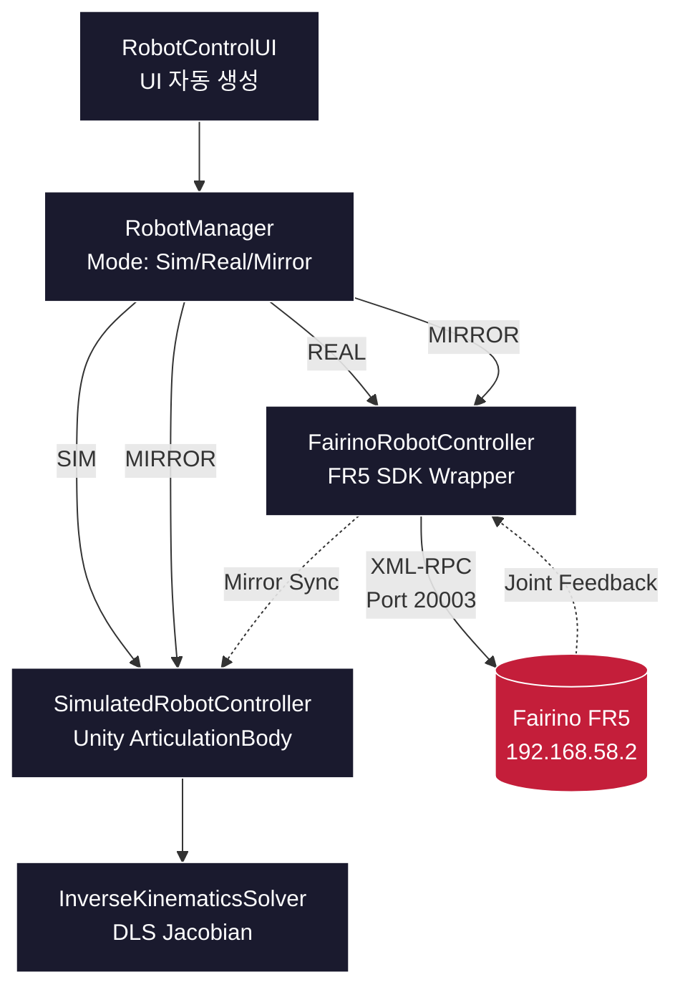

# 🤖 Fairino FR5 Digital Twin

> Unity 시뮬레이터와 산업용 협동로봇 Fairino FR5를 실시간 동기화하는 디지털 트윈 시스템

[](https://unity.com/)
[](https://docs.microsoft.com/en-us/dotnet/csharp/)
[](LICENSE)
[]()

<!-- 시각 자료 추가 예정: docs/images/demo.gif -->

---

## 📋 Overview

**Fairino FR5 Digital Twin**은 산업용 6-DOF 협동로봇과 Unity 3D 시뮬레이터를 통합한 디지털 트윈 시스템입니다. 실제 로봇과 가상 시뮬레이터가 양방향으로 동기화되며, **SIM / REAL / MIRROR** 세 가지 모드로 안전하게 테스트하고 운용할 수 있습니다.

| 항목 | 사양 |
|---|---|
| 로봇 모델 | Fairino FR5 (6-DOF 협동로봇) |
| Unity 버전 | 6000.0.64f1 |
| 언어 | C# (.NET Framework) |
| SDK | Fairino C# SDK (XML-RPC) |
| 통신 | Ethernet (192.168.58.2) |
| 개발 기간 | 2025–2026 |

---

## ✨ Features

### 🎮 통합 제어 시스템
- **SIM 모드**: 시뮬레이션 단독 동작 (실로봇 없이 테스트)
- **REAL 모드**: 실로봇 단독 제어
- **MIRROR 모드**: 시뮬+실로봇 동시 동기화 (Sim이 Real을 매 프레임 추종)

### 🦾 조인트·카티시안 제어
- 6축 조인트 슬라이더 + 직접 입력 + 정밀 조정 (±1°, ±5°)
- TCP 좌표(X/Y/Z/Rx/Ry/Rz) JOG 제어
- 한계값 자동 클램핑

### 🤏 그리퍼 & 포즈 관리
- 0~100% 개폐, 속도/힘 조절 (Fairino DH 그리퍼)
- 홈 포즈 저장/복귀, 3개 포즈 슬롯

---

## 🏗️ Architecture



**핵심 설계 원칙**: Mirror 모드에서 Sim은 Real의 그림자. Sim의 자체 IK를 사용하지 않고 Real의 결과를 매 프레임 재생함으로써 시각적 일치를 보장합니다.

---

## 🛠️ Tech Stack

- **Engine**: Unity 6000.0.64f1 (URP)
- **Language**: C# (.NET Framework)
- **Robotics**: Unity URDF Importer, ArticulationBody
- **IK**: Damped Least Squares (DLS) Jacobian (직접 구현)
- **Communication**: XML-RPC (CookComputing.XmlRpcV2)
- **Robot SDK**: Fairino C# SDK (libfairino.dll)

---

## 📁 Project Structure

fairino-fr5-digital-twin/
├── Assets/
│   └── Scripts/
│       └── RobotControl/
│           ├── IRobotController.cs
│           ├── RobotManager.cs
│           ├── SimulatedRobotController.cs
│           ├── FairinoRobotController.cs
│           ├── InverseKinematicsSolver.cs
│           ├── CoordinateConverter.cs
│           ├── GripperController.cs
│           └── RobotControlUI.cs
├── docs/
│   ├── DEVELOPMENT_LOG.md
│   └── SETUP.md
├── README.md
├── LICENSE
└── .gitignore

---

## 🚀 Getting Started

### Prerequisites
- Unity 6000.0.64f1
- URDF Importer 패키지
- Fairino FR5 + 펌웨어 (티치펜던트 Auto 모드)

### Installation
자세한 설치 가이드는 [`docs/SETUP.md`](docs/SETUP.md)를 참고하세요.

```bash
git clone https://github.com/kimar1022-code/fairino-fr5-digital-twin.git
```

### Network Configuration
| 항목 | 값 |
|---|---|
| Robot IP | `192.168.58.2` |
| PC IP | `192.168.58.100` |
| Subnet | `255.255.255.0` |

---

## 🐛 Troubleshooting

개발 중 해결한 주요 이슈들입니다. 자세한 디버깅 과정은 [`docs/DEVELOPMENT_LOG.md`](docs/DEVELOPMENT_LOG.md)에서 확인할 수 있습니다.

| 이슈 | 원인 | 해결 |
|---|---|---|
| **rc=14 joint command error** | Tool/Wobj 불일치 | Connect 시 자동 감지 |
| **MoveJ DescPose Zero 에러** | DescPose=(0,...) 시 IK 실패 | DescPose 인자 없는 오버로드 사용 |
| **조인트 간 간섭 (Critical)** | targetJointAngles 미동기화 | 변경 안 하는 관절을 현재 실측값으로 동기화 |
| **Cartesian JOG Sim/Real 불일치** | URDF DLS IK ≠ SDK IK | Mirror 모드에서 Sim IK 비활성화 |

### 🔑 가장 큰 발견: Sim은 Real의 그림자

```csharp
void Update()
{
    if (mode != Mode.Mirror) return;
    if (real == null || !real.IsConnected) return;

    for (int i = 0; i < real.JointCount; i++)
        sim.SetJointTarget(i, real.GetJointAngle(i));
}
```

Sim 자체 IK를 쓰면 URDF와 실로봇 운동학이 미묘하게 달라 카티시안 JOG에서 Sim/Real이 어긋났습니다. Sim의 IK를 비활성화하고 Real의 결과를 매 프레임 따라가게 함으로써 완벽한 시각적 동기화를 달성했습니다.

---

## 🛣️ Roadmap

- [x] **Phase 1**: URDF 임포트 + Sim/Real 인터페이스 통합
- [x] **Phase 2**: DLS Jacobian IK 솔버 구현
- [x] **Phase 3**: Mirror 동기화 패턴 설계
- [x] **Phase 4**: UI 자동 생성 + Pose Slot
- [ ] **Phase 5**: J5 시각적 불일치 해결
- [ ] **Phase 6**: 궤적 녹화/재생 기능
- [ ] **Phase 7**: 충돌 검출 시스템

---

## 📚 References

- [Unity URDF Importer](https://github.com/Unity-Technologies/URDF-Importer)
- [Fairino Official](https://www.fairino.com)
- Buss & Kim, *"Selectively Damped Least Squares for Inverse Kinematics"* (2005)

---

## 📜 License

본 프로젝트의 코드는 [MIT License](LICENSE)를 따릅니다.
- Fairino SDK: Fairino 라이선스
- URDF Importer: Unity Asset Store 약관

---

## 🙏 Acknowledgments

- **Fairino** — FR5 협동로봇 및 SDK
- **Unity Robotics** — URDF Importer
- 본 프로젝트는 AI 페어 프로그래밍 도구(Anthropic Claude)를 활용하여 개발되었으며, 시스템 설계·디버깅·아키텍처 결정은 작성자가 주도하였습니다.

---

<p align="center">
  <b>Author</b>: Aeri Kim · 
  <a href="https://github.com/kimar1022-code">GitHub</a> · 
  <a href="mailto:kimar1022@gmail.com">Email</a>
</p>
