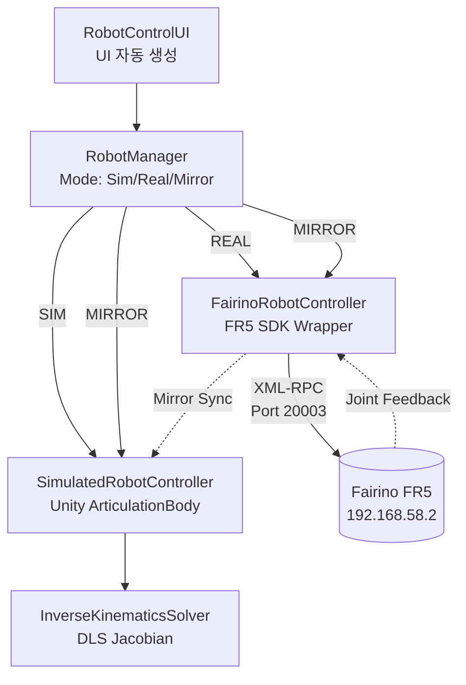

# Fairino FR5 Digital Twin

산업용 6축 협동로봇 Fairino FR5와 Unity 시뮬레이터를 실시간 동기화하는 디지털 트윈입니다.
실로봇 없이 테스트하는 SIM 모드, 실로봇 단독 제어 REAL 모드, 둘을 동시에 움직이는 MIRROR 모드를 지원합니다.

<!-- 시각 자료 추가 예정: docs/images/demo.gif -->

| 항목 | 사양 |
|---|---|
| 로봇 모델 | Fairino FR5 (6-DOF 협동로봇) |
| Unity 버전 | 6000.4.3f1 (URP) |
| 언어 | C# (.NET Framework) |
| SDK | Fairino C# SDK (XML-RPC, libfairino.dll) |
| 통신 | Ethernet (192.168.58.2) |
| 개발 기간 | 2025–2026 |

## 기능

제어 모드
- SIM: 시뮬레이션 단독 (실로봇 없이 테스트)
- REAL: 실로봇 단독 제어
- MIRROR: 시뮬 + 실로봇 동시 동기화 (Sim이 Real을 매 프레임 추종)

조인트·카티시안 제어
- 6축 조인트 슬라이더 + 직접 입력 + 정밀 조정 (±1°, ±5°)
- TCP 좌표(X/Y/Z/Rx/Ry/Rz) JOG 제어 — REAL/MIRROR는 SDK IK, SIM은 자체 DLS IK
- 한계값 자동 클램핑, 명령 포즈 드리프트 제한 (50mm / 15°)

그리퍼·포즈 관리
- 0~100% 개폐, 속도/힘 조절 (Fairino DH 그리퍼)
- 홈 포즈 저장/복귀, 3개 포즈 슬롯

## 구조



설계에서 가장 중요한 결정은 "Mirror 모드에서 Sim은 Real의 그림자"라는 것입니다.
Sim의 자체 IK를 쓰지 않고 Real의 관절 실측값을 매 프레임 그대로 재생합니다. 이유는 아래 트러블슈팅에.

- IK: Damped Least Squares(DLS) Jacobian 직접 구현
- URDF: Unity URDF Importer + ArticulationBody
- 통신: XML-RPC (CookComputing.XmlRpcV2)

## 파일 구성

```
fairino-fr5-digital-twin/
├── Assets/Scripts/RobotControl/
│   ├── IRobotController.cs
│   ├── RobotManager.cs
│   ├── SimulatedRobotController.cs
│   ├── FairinoRobotController.cs
│   ├── InverseKinematicsSolver.cs
│   ├── CoordinateConverter.cs
│   ├── GripperController.cs
│   └── RobotControlUI.cs
└── docs/
    ├── DEVELOPMENT_LOG.md   # 디버깅 과정 기록
    └── SETUP.md             # 설치 가이드
```

## 실행

Unity 6000.4.3f1 + URDF Importer 패키지, 로봇은 티치펜던트 Auto 모드가 필요합니다.
설치 과정은 [docs/SETUP.md](docs/SETUP.md)에 정리했습니다.

네트워크는 로봇 `192.168.58.2` / PC `192.168.58.100` / 서브넷 `255.255.255.0` 기준입니다.

## 트러블슈팅

| 이슈 | 원인 | 해결 |
|---|---|---|
| rc=14 joint command error | Tool/Wobj 불일치 | Connect 시 자동 감지 |
| MoveJ DescPose Zero 에러 | DescPose=(0,...) 시 IK 실패 | DescPose 인자 없는 오버로드 사용 |
| 조인트 간 간섭 | targetJointAngles 미동기화 | 변경 안 하는 관절을 현재 실측값으로 동기화 |
| Cartesian JOG Sim/Real 불일치 | URDF DLS IK ≠ SDK IK | Mirror 모드에서 Sim IK 비활성화 |
| SIM 단독 Cartesian JOG 무반응 | 명령 포즈 미누적 + 수렴 허용치가 JOG 스텝보다 큼 | 명령 포즈 누적 구조로 변경, 허용치 하향 |

Cartesian JOG Sim/Real 불일치가 이 프로젝트에서 배운 가장 큰 것입니다. Sim 자체 IK를 쓰면 URDF와 실로봇의
운동학이 미묘하게 달라 카티시안 JOG에서 Sim과 Real이 어긋납니다. Sim의 IK를 끄고
Real의 결과를 매 프레임 따라가게 해서 시각적 동기화를 맞췄습니다.

```csharp
void Update()
{
    if (mode != Mode.Mirror) return;
    if (real == null || !real.IsConnected) return;

    for (int i = 0; i < real.JointCount; i++)
        sim.SetJointTarget(i, real.GetJointAngle(i));
}
```

그 대가로 SIM 단독 모드의 Cartesian JOG는 검증 사각지대에 남았습니다. Mirror에서는
`RobotManager.StartCartesianJog`가 early return으로 SDK에 위임하므로 Unity IK 경로가 실행되지
않기 때문입니다. 실제로 눌러보니 로봇이 전혀 움직이지 않았고, 원인은 두 가지였습니다.

```csharp
// 1. 매 프레임 실제 TCP를 다시 읽어 명령이 누적되지 않음 (제자리 걸음)
- Vector3 target = baseTf.InverseTransformPoint(tcpTransform.position) + dir * step;
+ cmdLocalPos += dir * step;   // 명령 포즈에만 누적, JOG 시작 시 1회 초기화

// 2. 수렴 허용치 1mm가 프레임당 이동량 0.083mm보다 12배 커서 첫 반복에서 즉시 break
- public float positionTolerance = 0.001f;
+ public float positionTolerance = 0.00001f;
```

명령 포즈가 도달 불가 방향으로 무한히 누적되면 관절이 한계까지 밀려 비틀린 자세로 버팁니다.
그래서 실제 TCP 기준 위치 50mm / 자세 15° 이내로 제한했습니다(`maxCmdDriftM`, `maxCmdDriftDeg`).

좌표계 규약과 검증 현황은 [Assets/Scripts/RobotControl/COORDINATE_SYSTEM.md](Assets/Scripts/RobotControl/COORDINATE_SYSTEM.md)에 정리했습니다.
자세한 디버깅 과정은 [docs/DEVELOPMENT_LOG.md](docs/DEVELOPMENT_LOG.md)에 있습니다.

## 남은 작업

- J5 시각적 불일치 해결
- 궤적 녹화/재생 기능 → [v2](https://github.com/kimar1022-code/fairino-fr5-digital-twin-v2)에서 진행 중
- 충돌 검출

## 참고 자료

- [Unity URDF Importer](https://github.com/Unity-Technologies/URDF-Importer)
- [Fairino Official](https://www.fairino.com)
- Buss & Kim, "Selectively Damped Least Squares for Inverse Kinematics" (2005)

## 라이선스

코드는 [MIT License](LICENSE)를 따릅니다.
Fairino SDK는 Fairino 라이선스, URDF Importer는 Unity Asset Store 약관을 따릅니다.
